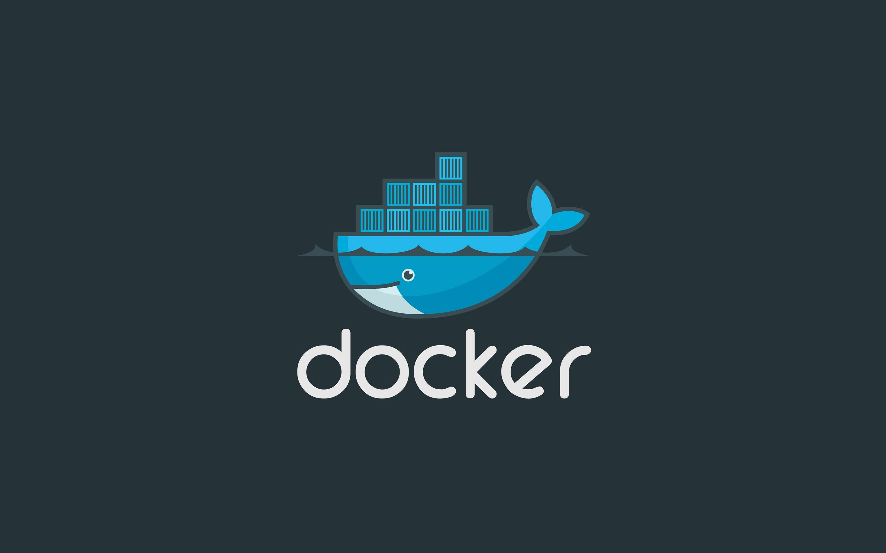

# Docker <Badge type="warning" text="beta" />

## 简介 <Badge type="danger" text="caution" />

快速构建、运行、管理应用的工具

类似于虚拟机可以单独隔离出一个环境，虚拟机是对整个操作系统的软硬件进行了模拟，但不同于虚拟机的是docker只包含了运行某一程序/服务所需要的所有文件、配置、依赖内核的函数库(能保证该程序执行的最小单元的封装)

## 核心概念

#### 镜像

镜像是一个只读的模板，通过Dockerfile 进行构建，构建时表明了该镜像的环境、依赖、如何运行等，构建后存储在镜像仓库

#### 容器

容器就像是一个个镜像的实例，环境被隔离开来，

#### 文件系统

#### 网络

#### 数据卷

