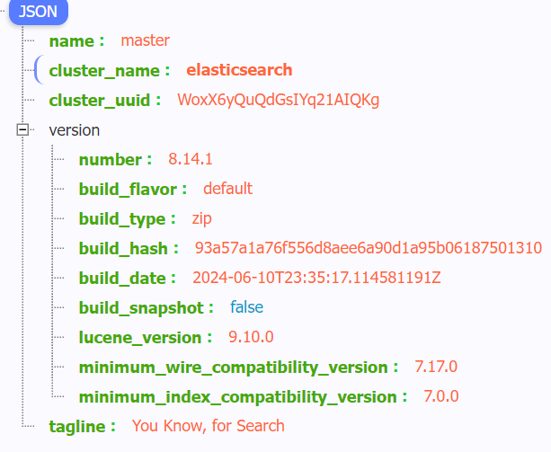
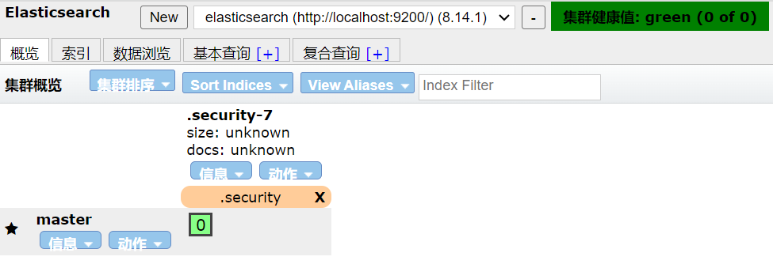

# ElasticSearch


> 引用：[Elasticsearch wikipedia](https://zh.wikipedia.org/wiki/Elasticsearch)

**Elasticsearch **是一个基于[Lucene](https://zh.wikipedia.org/wiki/Lucene)库的[搜索引擎](https://zh.wikipedia.org/wiki/搜索引擎)。它提供了一个分布式、支持多租户的[全文搜索](https://zh.wikipedia.org/wiki/全文檢索)引擎，具有[HTTP](https://zh.wikipedia.org/wiki/HTTP) Web接口和无模式[JSON](https://zh.wikipedia.org/wiki/JSON)文档。Elasticsearch是用[Java](https://zh.wikipedia.org/wiki/Java)开发的，并作为[开源软件](https://zh.wikipedia.org/wiki/看源软件)发布。官方客户端在[Java](https://zh.wikipedia.org/wiki/Java)、[.NET](https://zh.wikipedia.org/wiki/.NET框架)（[C#](https://zh.wikipedia.org/wiki/C♯)）、[PHP](https://zh.wikipedia.org/wiki/PHP)、[Python](https://zh.wikipedia.org/wiki/Python)、[Apache Groovy](https://zh.wikipedia.org/wiki/Groovy)、[Ruby](https://zh.wikipedia.org/wiki/Ruby)和许多其他语言中都是可用的。[[5\]](https://zh.wikipedia.org/wiki/Elasticsearch#cite_note-offizsite-5)根据DB-Engines的排名显示，Elasticsearch是最受欢迎的企业搜索引擎，其次是[Apache Solr](https://zh.wikipedia.org/wiki/Apache_Solr)，也是基于Lucene。[[6\]](https://zh.wikipedia.org/wiki/Elasticsearch#cite_note-6)

其适用于各种复杂的搜索场景。以下是一些核心概念和使用方法，包括安装、基本操作、常用查询和分析功能。

## 安装

官方下载网站

- [Elasticsearch下载](https://www.elastic.co/cn/downloads/elasticsearch)
- [Kibana可视化工具下载](https://www.elastic.co/cn/downloads/kibana)

### **启动**

1. 解压后进入bin目录 `./elasticsearch` 即可 -d 后台启动 

2. 开发环境可以在配置文件 `elasticsearch.yml` 中关闭安全检测` xpack.security.enabled: false` 将所有的 xpack 模块的都设为 false

3. 默认端口为 9200，单机启动下访问 127.0.0.1:9200 可查看节点信息

   

   其中 name 为节点名 可通过 `node.name: master` 进行配置

### **配置为 windows 服务**

进入bin目录运行` ./elasticsearch-service install`

### 可视化

Google 插件 `Elasticsearch Head` 可视化查看集群信息




### Kibana 启动

安装 bin 目录下 kibana.bat

默认访问端口 5601

## SpringBoot 整合

springboot 3.3.1 

jdk  21

1. 依赖

   ```xml
           <dependency>
               <groupId>org.springframework.boot</groupId>
               <artifactId>spring-boot-starter-data-elasticsearch</artifactId>
           </dependency>
   ```

2. 配置

   ```yml
   spring:
     data:
       elasticsearch:
         client:
           sync: // reactive
             endpoints: http://127.0.0.1:9200
   ```

   - Reactive 配置 (client.reactive.endpoints):
     这种配置适用于那些希望利用反应式编程模型与Elasticsearch交互的场景。反应式编程允许以非阻塞、事件驱动的方式处理数据流，特别适合于需要高并发处理和低延迟响应的应用。使用反应式客户端，你的应用可以更高效地管理资源，特别是在处理大量并发请求或与数据源交互时。选择此配置意味着你的应用程序将使用WebClient与Elasticsearch进行通信，这在处理高吞吐量场景时更为有效。
   - Sync 配置 (client.sync.endpoints):
     同步配置则是传统阻塞I/O模型的配置方式，即在发送请求后会等待响应完成才继续执行后续操作。这种方式编程模型简单直接，理解和实现成本较低，适用于对实时性要求不是极高且并发压力相对较小的应用场景。使用同步客户端（通常是RestHighLevelClient），代码编写更加直观，但可能在高并发场景下不如反应式客户端高效，因为它在每个请求上都会阻塞直到获得响应。
   - 总结来说，选择哪种配置取决于你的具体需求：如果你的应用需要处理大量并发请求并追求低延迟，反应式配置可能是更好的选择；如果项目规模较小，对性能要求不高，或者团队对反应式编程不太熟悉，那么使用同步配置会更加简便易行。

3. 使用

   