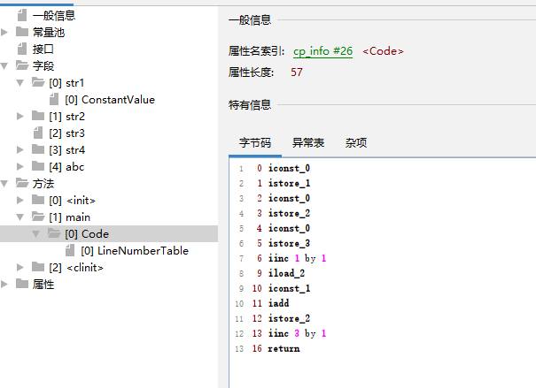

# 字节码指令杂谈

## 哪种 +1 的操作性能更好？

先来看一段代码，相信都很熟悉，对一个变量进行加 1

```java
public static void main(String[] args) {
	int i = 0, j = 0, k = 0;
	i++;
	j = j + 1;
	k += 1;
}
```

要判断它们操作的性能，就去查看字节码指令，这里使用 `jclasslib` 这个查看字节码文件的工具打开当前字节码文件



先了解两个概念

1. 局部变量表：存储方法中使用的局部变量（这里包括变量 i, j, k），java 编译的时候可以确定变量的顺序，并为这些变量进行标记 var0、var1、var2 等等，所以每个变量都是有一个自己的位置，并存储它们的值

2. 操作数栈：在进行算术运算时，临时存储操作数和计算结果

```java
// 0-5 行是把声明变量进行赋值
0 iconst_0     // 将常量 0 推送到操作数栈
1 istore_1     // 将操作数栈顶的值存储到变量 1（即 i）中
2 iconst_0     // 将常量 0 推送到操作数栈
3 istore_2     // 将操作数栈顶的值存储到变量 2（即 j）中
4 iconst_0     // 将常量 0 推送到操作数栈
5 istore_3     // 将操作数栈顶的值存储到变量 3（即 k）中
//
 
// i++;
6 iinc 1 by 1   // 变量 1（i）增加 1
//
 
// j = j + 1;
9 iload_2       // 将变量 2（j）的值加载到操作数栈顶
10 iconst_1     // 将常量 1 推送到操作数栈
11 iadd         // 将栈顶两个值相加，并将结果推送到操作数栈
12 istore_2     // 将操作数栈顶的值存储到变量 2（j）中
//

// k += 1;
13 iinc 3 by 1  // 变量 3（k）增加 1
//

16 return // 返回
```

补充：字节码指令的含义，可以参考官方的文档 [Chapter 6. The Java Virtual Machine Instruction Set](https://docs.oracle.com/javase/specs/jvms/se19/html/jvms-6.html#jvms-6.5)

额外：一般其实这种很小的细节性能都不影响，在编码选择的时候应该更注重清晰可读
