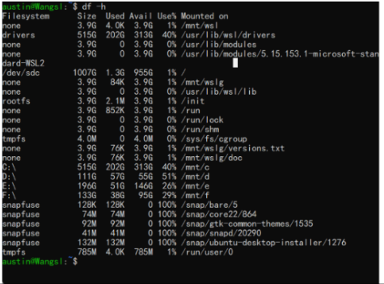
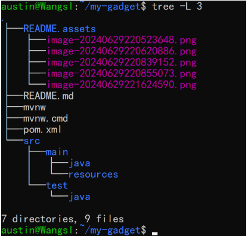
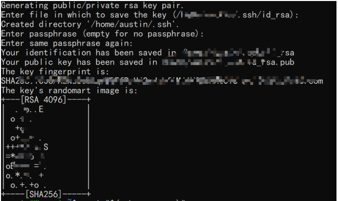
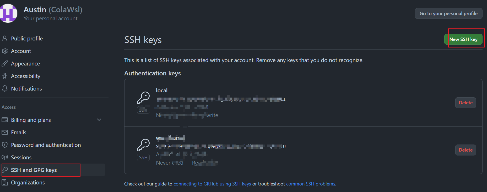
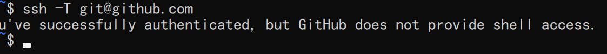
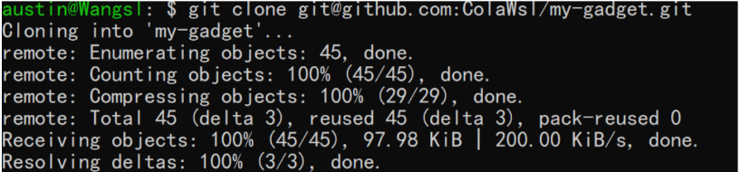

# Linux

发行版 Unbuntu 和 centos （更适合企业服务器 稳定）

## 基础知识

### 软件包

一般下载软件可以通过软件包，在 unbuntu 上是 apt ，centos 是 yum

## 常用命令

### df -h



## 常用软件

### tree

这是一个可以查看目录结构的命令，直接使用命令安装 `sudo apt install tree` 或者 `sudo yum install tree`

效果：



默认 `tree` 是全部展开，使用 `tree -L n` n 是展开的层级

## 常用配置

### 配置环境变量

### 配置 SSH 连接 github

SSH（Secure Shell，安全外壳）是**一种网络安全协议，通过加密和认证机制实现安全的访问和文件传输等业务**。 传统远程登录和文件传输方式，例如Telnet、FTP，使用明文传输数据，存在很多的安全隐患。

1. 检查是否已经有 SSH 密钥对

   ```sh
   ls -al ~/.ssh
   ```

2. 没有则创建

   ```sh
   ssh-keygen -t rsa -b 4096 -C "your_email@example.com
   ```
   
   
   
3. 添加 SSH 代理

   ```shell
   eval "$(ssh-agent -s)"
   ssh-add ~/.ssh/id_rsa
   ```

4. 添加 SSH 公钥到 Github

   ```sh
   cat ~/.ssh/id_rsa.pub
   ```

   Github -> settings -> SSH and GPG keys -> New SSH key

   

   将上面 cat 出来的内容复制粘贴到这里，名称自己取一个就行

5. 测试 SSH 连接

   ```sh 
   ssh -T git@github.com
   ```

   

6. 现在就可以通过 SSH 连接进行 Github 上的操作

   ```sh
   git clone git@github.com:ColaWsl/my-gadget.git
   ```

   


