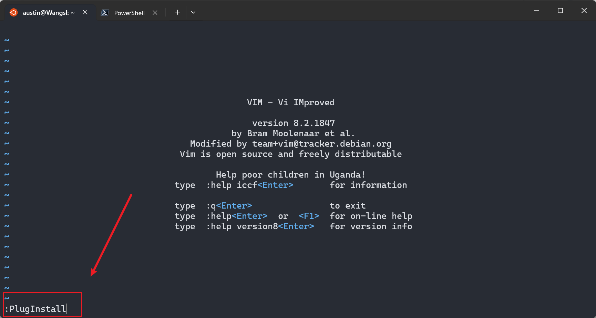
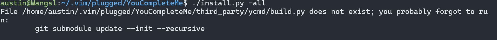
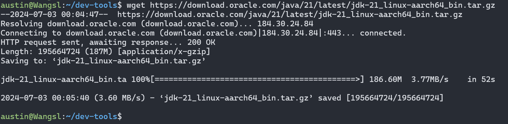

# Linux

发行版 Unbuntu 和 centos （更适合企业服务器 稳定）

## 基础知识

### 软件安装的选择 {#choice}

一般下载软件可以通过软件包，在 unbuntu 上是 apt ，centos 是 yum

这些链接提供了 Oracle JDK 21 的不同版本，针对不同的硬件架构和操作系统包格式。每个链接的区别如下：

#### 硬件架构：

1. **ARM64**: 针对基于 ARM 架构的 64 位处理器（通常用于移动设备和某些服务器）。
2. **x64**: 针对基于 x86 架构的 64 位处理器（通常用于大多数桌面和服务器）。

#### 文件格式：

1. **Compressed Archive (压缩归档文件)**:
   - **.tar.gz**: 这种格式是一个压缩的 tarball 文件，通常用于 Linux 系统。这种格式适合那些希望手动解压和安装 JDK 的用户。
2. **RPM Package (RPM 软件包)**:
   - **.rpm**: 这种格式是 Red Hat Package Manager 包，适用于基于 RPM 的 Linux 发行版，如 Red Hat Enterprise Linux (RHEL), CentOS 和 Fedora。使用这种格式的用户可以通过包管理器（如 `yum` 或 `dnf`）来安装和管理 JDK。
3. **Debian Package (Debian 软件包)**:
   - **.deb**: 这种格式是 Debian 包，适用于基于 Debian 的 Linux 发行版，如 Debian 和 Ubuntu。使用这种格式的用户可以通过包管理器（如 `apt`）来安装和管理 JDK。

#### 各个链接具体对应的文件：

1. **ARM64 Compressed Archive** (186.60 MB):
   - [下载链接](https://download.oracle.com/java/21/latest/jdk-21_linux-aarch64_bin.tar.gz)
2. **ARM64 RPM Package** (186.29 MB):
   - [下载链接](https://download.oracle.com/java/21/latest/jdk-21_linux-aarch64_bin.rpm)
3. **x64 Compressed Archive** (188.32 MB):
   - [下载链接](https://download.oracle.com/java/21/latest/jdk-21_linux-x64_bin.tar.gz)
4. **x64 Debian Package** (160.11 MB):
   - [下载链接](https://download.oracle.com/java/21/latest/jdk-21_linux-x64_bin.deb)
5. **x64 RPM Package** (188.00 MB):
   - [下载链接](https://download.oracle.com/java/21/latest/jdk-21_linux-x64_bin.rpm)

#### 总结：

- 根据你的处理器架构选择 ARM64 或 x64。
- 根据你的操作系统和包管理工具选择合适的文件格式（.tar.gz、.rpm 或 .deb）。
- 这样你就可以根据不同情况进行选择了，不用在纠结了


## 常用命令

### top 

### df -h 查看磁盘空间统计


## 常用软件

### Vim 编辑器

linux 中的编辑器

#### 使用方法


#### 配置插件

##### 自动补全 YouCompleteMe

1. **安装 Vim 插件管理器**

   首先，确保安装了 Vim 的插件管理器，比如 `vim-plug` 或者 `Vundle`。以 `vim-plug` 为例，可以通过以下命令安装：

   ```sh
   mkdir -p ~/.vim/autoload
   curl -fLo ~/.vim/autoload/plug.vim --create-dirs \
       https://raw.githubusercontent.com/junegunn/vim-plug/master/plug.vim
   ```

2. **配置 vim-plug**

   打开 .vimrc，把下面内容粘贴进去

   ```sh
   vim ~/.vimrc
   ```

   ```
   " 指定插件目录
   call plug#begin('~/.vim/plugged')
   
   " 示例：YouCompleteMe 插件
   Plug 'ycm-core/YouCompleteMe', { 'do': './install.py --all' }
   
   " 在此添加其他插件
   
   " 初始化插件系统
   call plug#end()
   
   ```

3. **安装插件**

   进入 vim 然后 :PlugInstall

   

4. **编译配置**

   进入到插件的目录，执行

   ```sh
   cd ~/.vim/plugged/YouCompleteMe
   ./install.py --all
   ```

   如果报错直接按照给的命令进行初始化，然后再执行 ./install.py --all

   

   初始化后，还报错的话，需要安装 cmake 和 python3，再继续执行上面命令

   ```sh
   sudo apt update
   sudo apt install cmake
   sudo apt install g++
   sudo apt install python3.10-dev
   sudo apt install golang
   ```

   如果需要按需加载语言可以添加参数 `--java-completer` 

### tree 目录结构查看

这是一个可以查看目录结构的软件，可以作为命令直接使用，直接使用命令安装 `sudo apt install tree` 或者 `sudo yum install tree`

效果：


默认 `tree` 是全部展开，使用 `tree -L n` n 是展开的层级

## 常用配置

### 配置环境变量

#### 配置 JDK

jdk 是开发 java 应用必备的 SDK（软件开发工具包），所以学会如何快捷、有序的安装组织 jdk 是有必要的

1. 下载 jdk

   关于如何下载 请查阅 [软件安装的选择](#choice)，然后在oracle官网[oracle JDK download](https://www.oracle.com/cn/java/technologies/downloads)选择一个 jdk 进行下载 

   在 linux 中使用 wget 命令即可

   ```sh
   wget https://download.oracle.com/java/21/latest/jdk-21_linux-aarch64_bin.tar.gz
   ```

   

2. 解压

   这里我选择的是 `x64 Compressed Archive` 所以需要解压

   ```sh
   tar -zxvf jdk-21_linux-aarch64_bin.tar.gz -C ./jdk/  # -C 指定位置
   ```

   切换至指定位置的目录 `jdk-21.0.3` 就解压成功了

   

3. 配置环境变量

   ```sh
   vim ~/.bashrc
   ```

   文件末尾追加：

   ```
   
   ```

   

#### 配置 python

#### 配置 golang

### 配置 SSH 连接 github

SSH（Secure Shell，安全外壳）是**一种网络安全协议，通过加密和认证机制实现安全的访问和文件传输等业务**。 传统远程登录和文件传输方式，例如Telnet、FTP，使用明文传输数据，存在很多的安全隐患。

1. 检查是否已经有 SSH 密钥对

   ```sh
   ls -al ~/.ssh
   ```

2. 没有则创建

   ```sh
   ssh-keygen -t rsa -b 4096 -C "your_email@example.com
   ```
   
   
   
3. 添加 SSH 代理

   ```shell
   eval "$(ssh-agent -s)"
   ssh-add ~/.ssh/id_rsa
   ```

4. 添加 SSH 公钥到 Github

   ```sh
   cat ~/.ssh/id_rsa.pub
   ```

   Github -> settings -> SSH and GPG keys -> New SSH key

   

   将上面 cat 出来的内容复制粘贴到这里，名称自己取一个就行

5. 测试 SSH 连接

   ```sh 
   ssh -T git@github.com
   ```

   

6. 现在就可以通过 SSH 连接进行 Github 上的操作

   ```sh
   git clone git@github.com:ColaWsl/my-gadget.git
   ```

   
