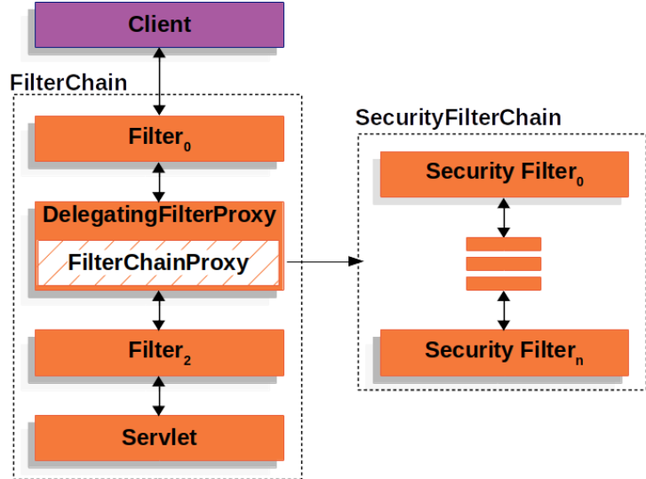

# Spring Security

## 是什么？

> Spring Security是一个Java框架，用于保护应用程序的安全性。它提供了一套全面的安全解决方案，包括身份验证、授权、防止攻击等功能。Spring Security基于过滤器链的概念，可以轻松地集成到任何基于Spring的应用程序中。它支持多种身份验证选项和授权策略，开发人员可以根据需要选择适合的方式。此外，Spring Security还提供了一些附加功能，如集成第三方身份验证提供商和单点登录，以及会话管理和密码编码等。总之，Spring Security是一个强大且易于使用的框架，可以帮助开发人员提高应用程序的安全性和可靠性。[^1]

简而言之，就是一个提供 Spring 应用安全的一个框架，属于 Spring 全家桶的其中之一。

## 怎么用？

## 原理

简单的用过之后，就来探究一下它的基本原理吧。大多框架用起来感觉很复杂，流程很多，但是这都是为了进行标准化、流程化和兼容其扩展带来的后果，但是其核心功能的处理是非常简单的

首先先来了解一下整个流程

### 从 HTTP 请求到响应的流程

大致可以分为：接收请求、过滤器链处理、安全检查、控制器处理和响应

#### 接收请求

当一个 HTTP 请求到达 Spring Boot 应用时，首先由 Servlet 容器（如 Tomcat）接收并处理。

#### 过滤器链

Spring Security 配置了一组过滤器链（Filter Chain）来对请求进行安全性检查，这个过滤器链在请求到达 Spring MVC 处理器之前进行处理

**主要过滤器**

- **SecurityContextPersistenceFilter**：
- **UsernamePasswordAuthenticationFilter**：
- **BasicAuthenticationFilter**：
- **ExceptionTranslationFilter**：
- **FilterSecurityInterceptor**：

#### 安全检查

#### 控制器处理

### 框架架构

#### 回顾原始的 Filter

先讲一下 JavaWeb 中的 Servlet，它是开发 Web 应用的核心组件之一，用于处理客户端发送的请求并生成响应。Servlet 运行需要一个容器（如 Tomcat）

再来看 filter，它是用于对请求和响应进行过滤的组件，通常实现横切关注点，如身份验证、日志记录、编码转换等。

- 在请求到达 servlet 之前，对请求进行预处理
- 在响应离开服务器之前，对请求进行后置处理

## DelegatingFilterProxy[^4]

DelegatingFilterProxy 是 Spring 提供的一个 Filter 的实现，在 Servlet 容器的生命周期和 Spring 的 ApplicationContext 建立了联系，因为 servlet 容器没法识别由 Spring 定义的 Bean。但此时spring 通过标准的 filter 的实现方法，实现了 DelegatingFilterProxy ，和 servlet 容器产生了绑定，但将所有的工作委托给了实现 Filter 的 Spring bean。

好处：

- 通过 spring 来管理 filter 的生命周期
- 在 filter 中可以直接注入需要的容器

在Spring 提供的DelegatingFilterProxy（基于标准的 Filter 实现的）中，就可以注入 Spring 容器中管理的 Bean。所以，Spring Security 提供了一个 FilterChainProxy bean，将DelegatingFilterProxy 的功能委托到 FilterChainProxy 中，然后FilterChainProxy 又委托给具体的 SecurityFilterChain 完成过滤器链的配置



### 认证/校验

#### 基于内存的用户校验

1. 创建 InMemoryUserDetailsManager（UserDetailsService 对象然后将 用户的信息 UserDetails 保存在内存中 users 变量（hashmap 结构）(**这里是不是可以从其他地方读入用户信息呢**)

2. 当请求到达 UsernamePasswordAuthenticationFilter 时，attemptAuthentication 方法会从 HttpServletRequest 中获取到用户的账户密码并封装成 UsernamePasswordAuthenticationToken（**输入的用户和密码**） 对象

3. 然后传入  UserDetailsAuthenticationProvider 的 authenticate 方法进行校验（判断用户密码是否一致），方法里面获取了 UserDetailsService 也就是 InMemoryUserDetailsManager 对象，然后调用了 loadUserByUsername 得到 UserDetails 对象

   整个流程的总结就是，先保存用户信息，然后把请求来的用户密码，和保存的用户信息进行比对

#### 基于其他数据源的校验（数据库）

当用户的信息不再是临时存储到内存时，而是存在数据库中，这时候我们需要从数据库中查询用户的账号和密码

从上面基于内存的校验可以知道校验时需要去调用 loadUserByUsername 去得到用户的信息 UserDetails，所以需要去实现

UserDetailsService 接口，重写 loadUserByUsername 方法，根据这个方法传入的参数 username 去数据库中查询用户的信息

然后封装成 UserDetails 对象返回

```java
@Override
	public UserDetails loadUserByUsername(String username) throws UsernameNotFoundException {
		// 根据用户名从数据库中查询用户的信息
        User user = userMapper.selectOne(new LambdaQueryWrapper<User>().eq(User::getUsername, username));
		if(Objects.isNull(user)){
			log.error("username is not exist");
			throw new UsernameNotFoundException(username);
		}

        // 封装成 UserDetails 对象返回
		Collection<GrantedAuthority> authorities = new ArrayList<>();
		return new org.springframework.security.core.userdetails.User(
				user.getUsername(),
				user.getPassword(),
				user.getEnabled() == 1,
				true,
				true,
				true,
				authorities
		);
	}
```

```java
	// 在 SpringSecurity 的配置类中进行注册
	@Bean
	public UserDetailsService userDetailsService() {
		// db based
		DBUserDetailsManager manager = new DBUserDetailsManager();
		return manager;
	}
```

### 用户的增删改查

在 UserDetailsManager 接口中有如下几个方法

```java
public interface UserDetailsManager extends UserDetailsService {
    void createUser(UserDetails user);
    
    void updateUser(UserDetails user);
    
    void deleteUser(String username);
    
    void changePassword(String oldPassword, String newPassword);
    
    boolean userExists(String username);
}
```

在开发中基本都是会采用基于数据库的校验，所以自然我们会实现 UserDetailsManager 这个接口

此时我们在 Controller 层添加一个 add user 的方法

```java
	@PostMapping("/add")
	public String add(@RequestBody User user) {
		userService.saveUserDetials(user);
		return "success";
	}

	
	@Service
	public class UserServiceImpl extends ServiceImpl<UserMapper, User>
		implements UserService {

	@Autowired
	private UserDetailsManager dbUserDetailsManager;

    // service层需要去调用 manager 的一系列的管理用户的方法，在这里是 createUser
	@Override
	public void saveUserDetials(User user) {
		dbUserDetailsManager.createUser(
				org.springframework.security.core.userdetails.User
						.withUsername(user.getUsername())
						.password(user.getPassword())
						// .roles("USER")
						.build()
		);
	}
}
```

接下来就要重写 createUser 方法

```java
	@Override
	public void createUser(UserDetails userDetails) {
		User user = new User();
		user.setUsername(userDetails.getUsername());
		user.setPassword(passwordEncoder.encode(userDetails.getPassword())); // 加密
		user.setEnabled(1); // 1 为有效用户
		int insert = userMapper.insert(user);
		if(insert < 1){
			throw new RuntimeException("新增用户失败");
		}
	}
```


[^1]: [Spring Security 中文文档](https://springdoc.cn/spring-security/)
[^2]: [秒懂SpringBoot之全网最易懂的Spring Security教程](https://shusheng007.top/2023/02/15/springsecurity/)
[^3]: [ChatGPT](https://chatgpt.com/)
[^4]: [DelegatingFilterProxy原理和作用](https://blog.csdn.net/fly910905/article/details/95062258)
[^5]: [尚硅谷-SpringSecurity](https://www.bilibili.com/video/BV14b4y1A7Wz?p=11&vd_source=435365fdb367460544380bcadef5ec1b)